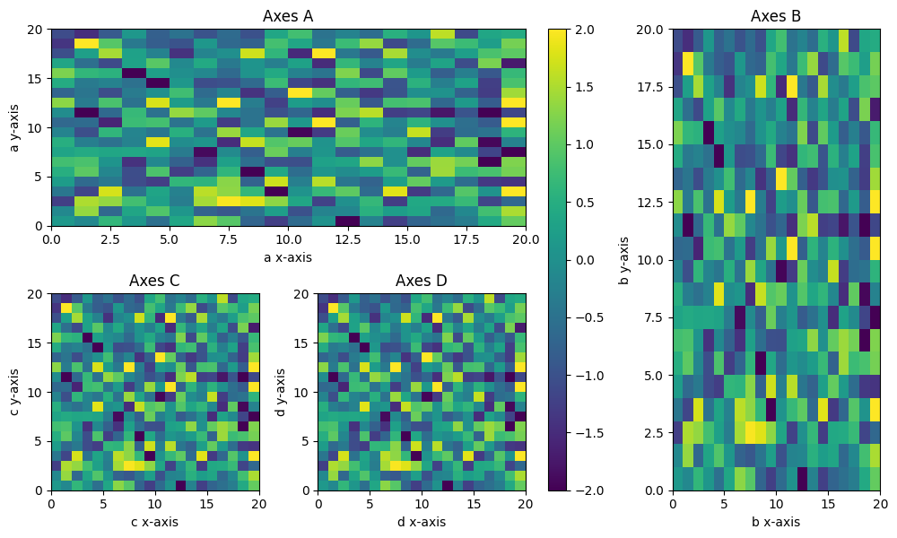

# mpl-direct-layout

[](https://github.com/jklymak/mpl-direct-layout/actions/workflows/tests.yml)
[](https://jklymak.github.io/mpl-direct-layout/)

A kiwisolver-free layout engine for [Matplotlib](https://matplotlib.org) that
positions axes using direct algebraic solving rather than constraint
optimisation.



## Documentation

Full documentation is available at **[jklymak.github.io/mpl-direct-layout](https://jklymak.github.io/mpl-direct-layout/)**

## Why?

Matplotlib's `constrained_layout` requires `kiwisolver`.  `mpl-direct-layout`
achieves the same goal — tight, non-overlapping axes with proper label spacing
— using only NumPy arithmetic, making it lighter and faster for simple grids.

## Features

- Drop-in replacement: use `layout='direct'` wherever you would use
  `layout='constrained'`
- Colorbars (right / left / top / bottom, single or shared across axes)
- Mosaic layouts (`fig.subplot_mosaic`)
- Spanning axes
- `width_ratios` / `height_ratios`
- `suptitle`, `supxlabel`, `supylabel`
- Subfigures (including nested)
- Configurable outer margins and padding

## Installation

```bash
pip install mpl-direct-layout
```

### Development install

```bash
git clone https://github.com/jklymak/mpl-direct-layout
cd mpl-direct-layout
pip install -e ".[test,docs]"
```

## Quick start

```python
import mpl_direct_layout          # registers the engine
import matplotlib.pyplot as plt

fig, axs = plt.subplots(2, 2, layout='direct')
for ax in axs.flat:
    ax.plot([1, 2, 3])
    ax.set_xlabel('x-label')
    ax.set_ylabel('y-label')
    ax.set_title('Title')
fig.suptitle('Direct layout')
plt.show()
```

## Customisation

```python
fig = plt.figure(layout='direct')
eng = fig.get_layout_engine()
eng.set(
    h_pad=6/72,        # 6 pt vertical padding between axes
    w_pad=6/72,        # 6 pt horizontal padding
    left=0.1,          # 0.1" left outer margin
    right=0.1,
    top=0.1,
    bottom=0.1,
    suptitle_pad=0.15, # 0.15" gap below suptitle
)
```

## Running the tests

```bash
# Generate baseline images (first time only)
pytest tests/ --mpl-generate-path=tests/baseline_images

# Run image comparison tests
pytest tests/ --mpl
```

## Project layout

```
src/mpl_direct_layout/
    __init__.py     re-exports DirectLayoutEngine; registers 'direct' layout key
    _engine.py      the layout engine implementation
tests/
    conftest.py
    test_layout.py  pytest-mpl image-comparison tests
docs/
    conf.py, index.rst, usage.rst, api.rst
```
