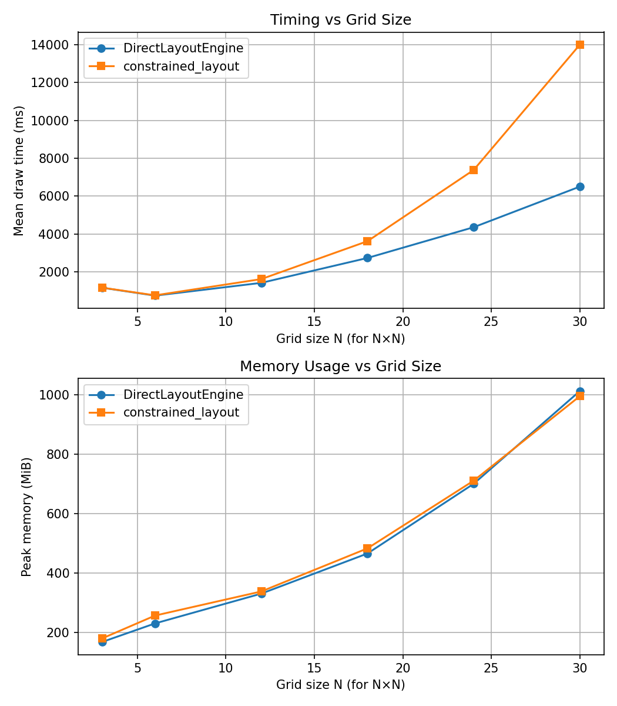

Comparison with constrained_layout
====================================

This page shows ``layout='direct'`` compared side-by-side with Matplotlib's
built-in ``layout='constrained'`` to demonstrate similar behavior.

Basic grid
----------

Both engines handle basic subplot grids with labels and titles:

.. plot::
   :include-source: False

   import matplotlib.pyplot as plt
   import mpl_direct_layout
   import numpy as np

   # Left: direct layout
   fig_direct = plt.figure(figsize=(5.5, 4), layout='direct', facecolor='0.7')
   axs_direct = fig_direct.subplots(2, 3)
   for ax in axs_direct.flat:
       ax.plot([1, 2, 3])
       ax.set_xlabel('x-label')
       ax.set_ylabel('y-label')
       ax.set_title('Title')
   fig_direct.suptitle("layout='direct'")

   # Right: constrained layout
   fig_const = plt.figure(figsize=(5.5, 4), layout='constrained', facecolor='0.7')
   axs_const = fig_const.subplots(2, 3)
   for ax in axs_const.flat:
       ax.plot([1, 2, 3])
       ax.set_xlabel('x-label')
       ax.set_ylabel('y-label')
       ax.set_title('Title')
   fig_const.suptitle("layout='constrained'")

   plt.show()

Shared colorbar
---------------

Both engines support shared colorbars across multiple axes:

.. plot::
   :include-source: False

   import matplotlib.pyplot as plt
   import mpl_direct_layout
   import numpy as np

   # Left: direct layout
   fig_direct = plt.figure(figsize=(5.5, 4), layout='direct', facecolor='0.7')
   axs_direct = fig_direct.subplots(2, 2)
   for ax in axs_direct.flat:
       pcm = ax.pcolormesh(np.random.rand(10, 10))
   fig_direct.colorbar(pcm, ax=axs_direct, location='right', shrink=0.6)
   fig_direct.suptitle("layout='direct'")

   # Right: constrained layout
   fig_const = plt.figure(figsize=(5.5, 4), layout='constrained', facecolor='0.7')
   axs_const = fig_const.subplots(2, 2)
   for ax in axs_const.flat:
       pcm = ax.pcolormesh(np.random.rand(10, 10))
   fig_const.colorbar(pcm, ax=axs_const, location='right', shrink=0.6)
   fig_const.suptitle("layout='constrained'")

   plt.show()

Mosaic layout
-------------

Complex mosaic layouts with shared colorbars:

.. plot::
   :include-source: False

   import matplotlib.pyplot as plt
   import mpl_direct_layout
   import numpy as np

   # Left: direct layout
   fig_direct = plt.figure(figsize=(6, 4), layout='direct', facecolor='0.7')
   axd_direct = fig_direct.subplot_mosaic([['a', 'a', 'b'],
                                            ['c', 'd', 'b']])
   for label, ax in axd_direct.items():
       pcm = ax.pcolormesh(np.random.rand(10, 10))
       ax.set_title(f'Axes {label}')
   fig_direct.colorbar(pcm, ax=[axd_direct['a'], axd_direct['c'], axd_direct['d']],
                       location='right')
   fig_direct.suptitle("layout='direct'")

   # Right: constrained layout
   fig_const = plt.figure(figsize=(6, 4), layout='constrained', facecolor='0.7')
   axd_const = fig_const.subplot_mosaic([['a', 'a', 'b'],
                                          ['c', 'd', 'b']])
   for label, ax in axd_const.items():
       pcm = ax.pcolormesh(np.random.rand(10, 10))
       ax.set_title(f'Axes {label}')
   fig_const.colorbar(pcm, ax=[axd_const['a'], axd_const['c'], axd_const['d']],
                       location='right')
   fig_const.suptitle("layout='constrained'")

   plt.show()

Super-labels
------------

Both engines handle suptitle, supxlabel, and supylabel:

.. plot::
   :include-source: False

   import matplotlib.pyplot as plt
   import mpl_direct_layout

   # Left: direct layout
   fig_direct = plt.figure(figsize=(5, 4), layout='direct', facecolor='0.7')
   axs_direct = fig_direct.subplots(2, 2)
   for ax in axs_direct.flat:
       ax.plot([1, 2, 3])
       ax.set_xlabel('x')
       ax.set_ylabel('y')
   fig_direct.suptitle('Overall title')
   fig_direct.supxlabel('Shared x-label')
   fig_direct.supylabel('Shared y-label')

   # Right: constrained layout
   fig_const = plt.figure(figsize=(5, 4), layout='constrained', facecolor='0.7')
   axs_const = fig_const.subplots(2, 2)
   for ax in axs_const.flat:
       ax.plot([1, 2, 3])
       ax.set_xlabel('x')
       ax.set_ylabel('y')
   fig_const.suptitle('Overall title')
   fig_const.supxlabel('Shared x-label')
   fig_const.supylabel('Shared y-label')

   plt.show()

Key Differences
---------------

**Performance:**
  - ``direct`` uses only NumPy arithmetic
  - ``constrained`` uses the kiwisolver constraint solver

**Dependencies:**
  - ``direct`` requires only NumPy (already required by Matplotlib)
  - ``constrained`` requires the additional ``kiwisolver`` package

**Tuning:**
  - ``direct`` uses physical units (inches) for margins and padding
  - ``constrained`` uses relative units and heuristics

**Use Cases:**
  - ``direct`` is ideal when you want precise control over spacing in physical units
  - ``constrained`` may handle more complex edge cases and has years of production use

Performance
-----------

   Timing and peak memory usage for DirectLayoutEngine vs constrained_layout on grids up to 30×30 axes.
   (See benchmark_timing_memory.txt for system details.)

The plot above was generated using the benchmark script in the repository. For reproducibility, system and environment details are saved in ``benchmark_timing_memory.txt``:

.. literalinclude:: ../benchmark_timing_memory.txt
   :language: none
   :caption: System and environment details for the benchmark run

.. note::
   The benchmark is not run as part of the documentation build, to avoid long runtimes. The image and system info are static outputs from a single run.
